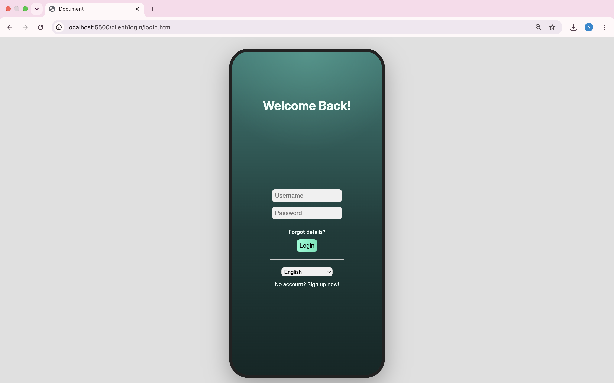
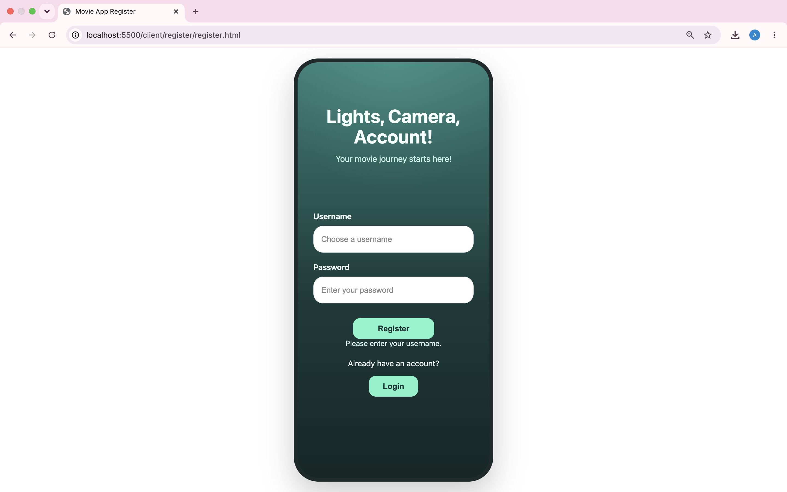
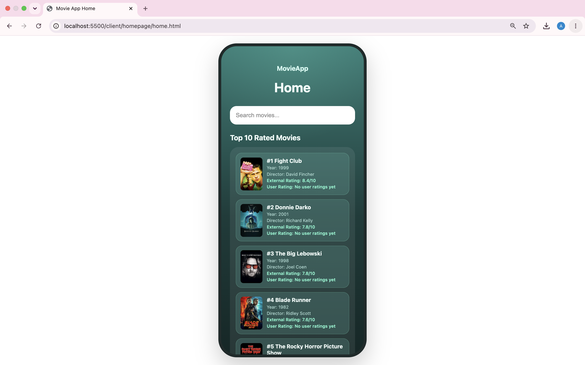
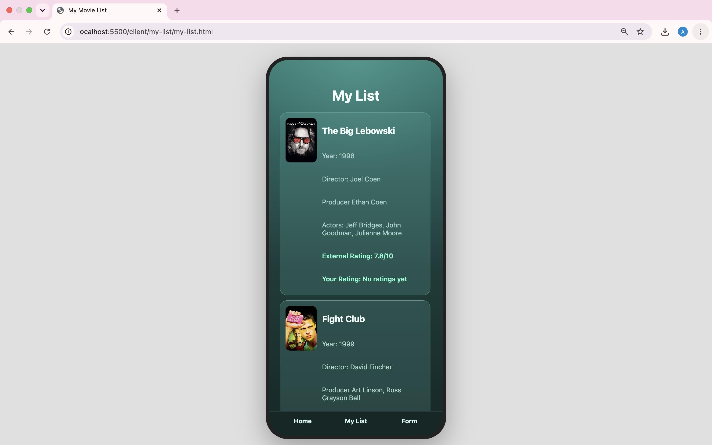
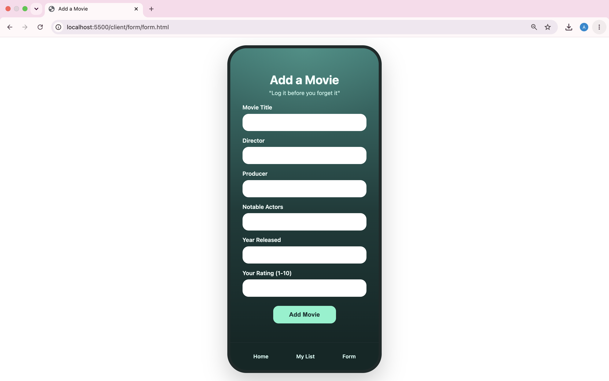

# MovieApp

> Developed as part of a collaborative team project at La Fosse Academy. My contributions focused on backend development, authentication, database design, API integration, and Docker containerisation.

## Overview

MovieApp is a full-stack movie tracking application that allows users to record watched films, manage personal ratings, and view external movie information. The application combines a responsive frontend with a Node.js and Express backend, PostgreSQL database, JWT authentication, and third-party API integrations to provide a personalised movie tracking experience.

## Technologies

### Frontend
- HTML
- CSS
- JavaScript

### Backend
- Node.js
- Express

### Database
- PostgreSQL

### Authentication
- JWT Authentication

### APIs & Integrations
- TMDB API
- Gemini AI

### DevOps & Tools
- Docker
- Git
- GitHub

## Key Features

- Secure user registration and login using JWT authentication
- Personal movie collection management
- User movie ratings and reviews
- External movie ratings and poster integration through TMDB
- AI-powered recommendation functionality
- PostgreSQL relational database design
- RESTful API architecture
- Docker containerisation for consistent deployment

## Architecture

```text
Frontend (HTML, CSS, JavaScript)
            │
            ▼
      Express REST API
            │
    ┌───────┴───────┐
    ▼               ▼
PostgreSQL      External APIs
 Database      (TMDB & Gemini)
```

## My Contribution

My primary contributions focused on the backend architecture and data layer of the application, including:

- Developing backend functionality using Node.js and Express
- Implementing JWT authentication and route protection
- Designing and building PostgreSQL database models and relationships
- Creating RESTful API endpoints
- Integrating external movie data through the TMDB API
- Supporting Docker-based deployment and development workflows
- Contributing to debugging, testing, and application integration
- Working collaboratively through Git feature branches and pull requests

## Screenshots

| Login | Register |
|---------|---------|
|  |  |

| Homepage | My List |
|---------|---------|
|  |  |

| Add Movie |
|---------|
|  |

## What I Learned

This project strengthened my understanding of full-stack software development and how frontend, backend, database, and external services interact within a production-style application.

Key learning areas included:

- Building RESTful APIs using Express
- Implementing authentication using JWT tokens
- Designing relational database schemas in PostgreSQL
- Integrating third-party APIs and handling external data
- Containerising applications with Docker
- Debugging issues across multiple application layers
- Working collaboratively using Git workflows and pull requests
- Managing application data securely between frontend and backend services

## Future Improvements

Potential future enhancements include:

- Improved recommendation engine using AI and user preferences
- User profile customisation
- Watchlist functionality
- Social features and movie sharing
- Enhanced frontend responsiveness
- Additional automated testing coverage
- Cloud deployment using modern DevOps tooling
- Real-time movie recommendation updates
- Advanced analytics and user insights